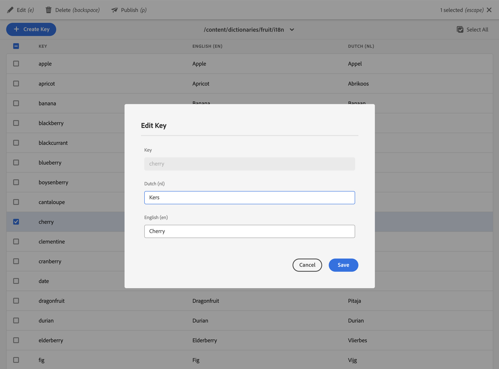

[](https://search.maven.org/artifact/be.orbinson.aem/aem-dictionary-translator.all)
[](https://github.com/orbinson/aem-dictionary-translator/releases)
[](https://github.com/orbinson/aem-dictionary-translator/actions/workflows/build.yml)
[](https://plugins.jetbrains.com/plugin/9269-aem-ide)

# AEM Dictionary Translator

AEM TouchUI tool to translate dictionaries for i18n internationalisation in AEM as a Cloud Service. The AEM
Dictionary Translator is a replacement for the
ClassicUI [translator](http://localhost:4502/libs/cq/i18n/translator.html) which is not available on AEMaaCS.

The [AEM Dictionary Translator](http://localhost:4502/tools/translation/dictionaries.html) is available under `Tools` >
`Translation` > `Dictionary`.




## Installation

### Compatibility matrix

The minimal required AEM and AEM Dictionary Translator versions are:

| AEM Type | AEM version                     | AEM Dictionary Translator |
|----------|---------------------------------|---------------------------|
| AEM 6.5  | `6.5.17`                        | `1.3.0`                   |
| AEMaaCS  | `2023.1.10912.20230130T173736Z` | `1.0.0`                   |

The minimal required Java version is `11`.

**Note:** AEM 6.5 is supported on a best-effort basis and will not undergo active testing or bug fixing. Known issues exist in service packs 18, 19, and 20. We depend on the community to help identify and resolve bugs through pull request contributions.

### Package installation

To deploy the AEM Dictionary Translator as an embedded package you need to update your `pom.xml`

1. Add the `aem-dictionary-translator.all` to the `<dependencies>` section

   ```xml
   <dependency>
     <groupId>be.orbinson.aem</groupId>
     <artifactId>aem-dictionary-translator.all</artifactId>
     <version><!-- Replace with last released version on Maven Central --></version>
     <type>zip</type>
   </dependency>
   ```
2. Embed the package in with
   the [filevault-package-maven-plugin](https://jackrabbit.apache.org/filevault-package-maven-plugin/) in
   the `<embeddeds>` section

   ```xml
   <embedded>
      <groupId>be.orbinson.aem</groupId>
      <artifactId>aem-dictionary-translator.all</artifactId>
      <target>/apps/vendor-packages/content/install</target>
   </embedded>
   ```

3. Currently, AEMaaCS doesn't allow loading of i18n dictionaries outside `/apps`,  `/libs`, `/content/forms/af` and
   `/content/dam/formsanddocuments`.

To mitigate this, update the `org.apache.sling.i18n.impl.JcrResourceBundleProvider` OSGi config to allow dictionaries in
other folders, for example by using `/content/dictionaries` for all your editable dictionaries.

Example `org.apache.sling.i18n.impl.JcrResourceBundleProvider` OSGi config

```json
{
  "included.paths": [
    "/libs",
    "/apps",
    "/content/forms/af",
    "/content/dam/formsanddocuments",
    "/content/dictionaries"
  ]
}

```

## Limitations

1. Only [`sling:Message` or `sling:MessageEntry` based dictionaries](https://sling.apache.org/documentation/bundles/internationalization-support-i18n.html#slingmessageentry-jcrprimarytype-or-slingmessage-jcrmixintypes-based) are supported in edit mode, the ones in [JSON format](https://github.com/orbinson/aem-dictionary-translator/issues/26) are exposed in read-only mode.
2. Due to the [search order of dictionaries](https://sling.apache.org/documentation/bundles/internationalization-support-i18n.html#resourcebundle-hierarchies) it is not possible to overwrite entries from dictionaries within `/libs` (shipped with AEM) with different translations leveraging a dictionary placed below `/content`.

## Development

If you want to contribute to the project make sure to check the contribution guidelines in [CONTRIBUTING.md](CONTRIBUTING.md).

To build all the modules run in the project root directory the following command

```shell
mvn clean install
```

To build all the modules and deploy the `all` package to a local instance of AEM, run in the project root directory the
following command

```shell
mvn clean install -PautoInstallSinglePackage
```

This project follows the [AEM Archetype](https://github.com/adobe/aem-project-archetype) conventions so for further
guidelines consult the available documentation.

### UI Tests

The project contains a set of UI tests with basic coverage for the AEM Dictionary Translator UI.

To run the UI tests, first install the `it.content` module to your local AEM instance.
Do note that the `it.content` module is not part of the `all` package and that it always needs to be installed separately.

**Warning:** When installing the `it.content` module, some paths will be overwritten like `/apps/wcm/core/resources/languages` and `/etc/replication/agents.author`.

```shell
mvn clean install -pl it.content -PautoInstallPackage
```

Afterward run the UI tests with the following command

```shell
mvn clean test -pl ui.tests -DskipTests=false
```
