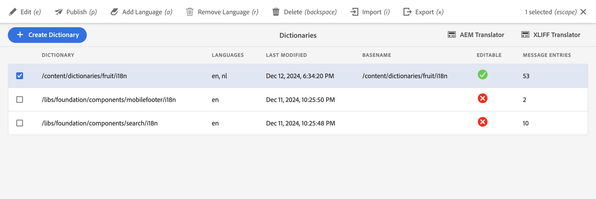

[](https://search.maven.org/artifact/be.orbinson.aem/aem-dictionary-translator.all)
[](https://github.com/orbinson/aem-dictionary-translator/releases)
[](https://github.com/orbinson/aem-dictionary-translator/actions/workflows/build.yml)
[](https://plugins.jetbrains.com/plugin/9269-aem-ide)

# AEM Dictionary Translator

AEM TouchUI tool to translate labels for i18n internationalisation in AEM on premise or AEM as a Cloud Service. The AEM
Dictionary Translator is a replacement for the
ClassicUI [translator](http://localhost:4502/libs/cq/i18n/translator.html) which is not available on AEMaaCS.




## Installation

To deploy the AEM Dictionary Translator as an embedded package you need to update your `pom.xml`

1. Add the `aem-dictionary-translator.all` to the `<dependencies>` section

   ```xml
   <dependency>
     <groupId>be.orbinson.aem</groupId>
     <artifactId>aem-dictionary-translator.all</artifactId>
     <version>1.0.1</version>
     <type>zip</type>
   </dependency>
   ```
2. Embed the package in with
   the [filevault-package-maven-plugin](https://jackrabbit.apache.org/filevault-package-maven-plugin/) in
   the `<embeddeds>` section

   ```xml
   <embedded>
      <groupId>be.orbinson.aem</groupId>
      <artifactId>aem-dictionary-translator.all</artifactId>
      <target>/apps/vendor-packages/content/install</target>
   </embedded>
   ```

## Development

To build all the modules run in the project root directory the following command

```shell
mvn clean install
```

To build all the modules and deploy the `all` package to a local instance of AEM, run in the project root directory the
following command

```shell
mvn clean install -PautoInstallSinglePackage
```

This project follows the [AEM Archetype](https://github.com/adobe/aem-project-archetype) conventions so for further
guidelines consult the available documentation.
